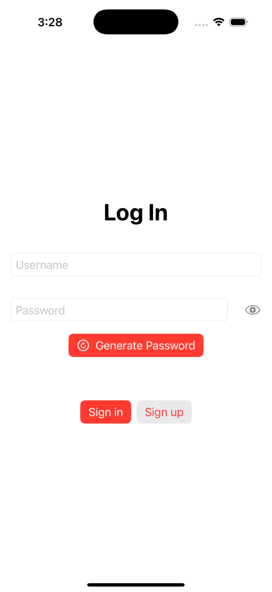
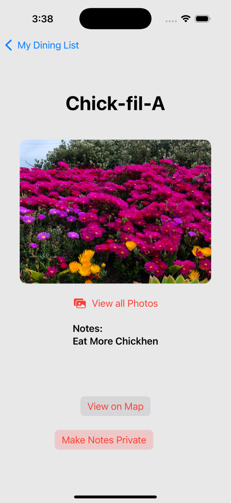
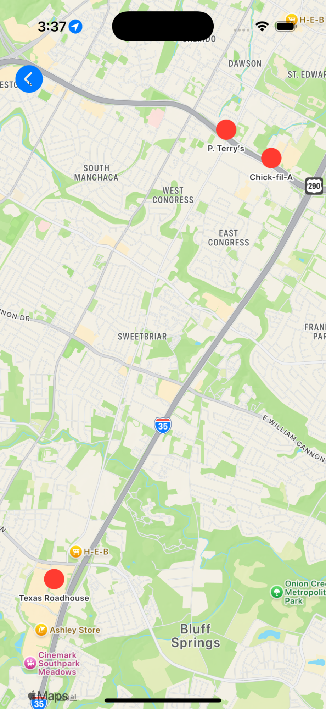
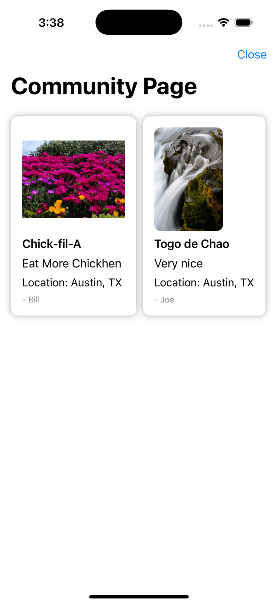
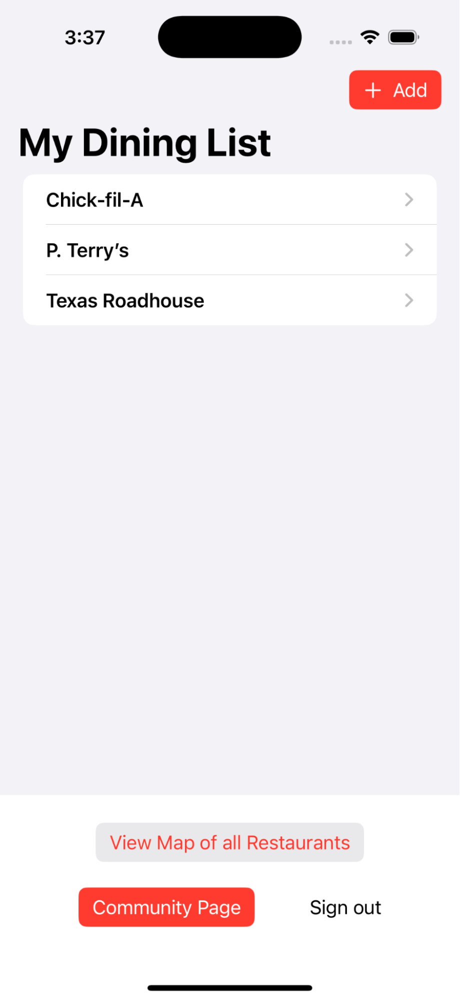
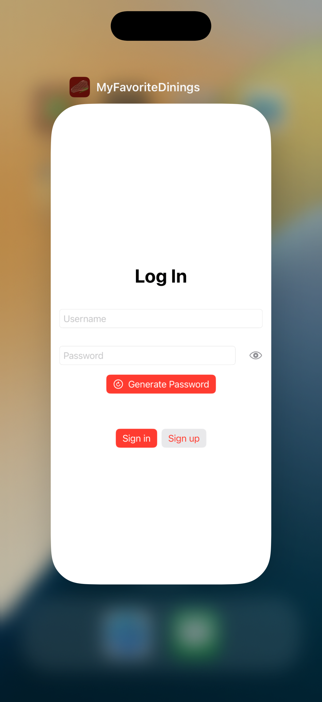

# MyFavoriteDinnings_App

The app that I have chosen to create is called My Favorite Dinings. The app will function as a place to see all of your favorite restaurants in one place. Sometimes you may eat at a restaurant and think it was really good, but later after months you forget it existed. The app will have features like maps to show you the location, an option to add notes or upload images about the restaurant, and a public notes page where you can view other user’s experiences.

## Photos:

  
  
  
  
  
  

*Note: This app is not currently designed to be scalable, but has the framework to be. The app will need to be connected to an external firebase to store data for many users.

### Credits: Anastasia Martinez - Launch Screen Drawing

Version: SwiftUI 16.4
